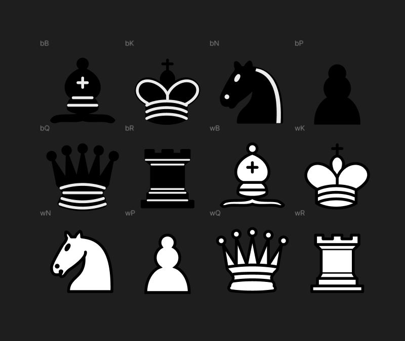
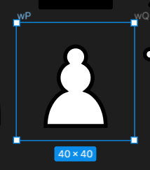
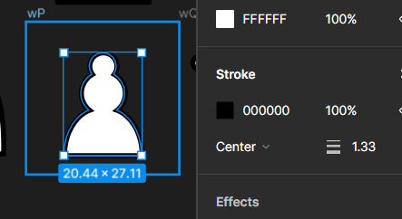
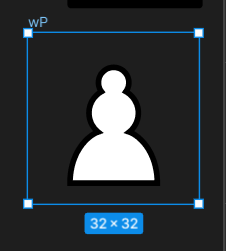
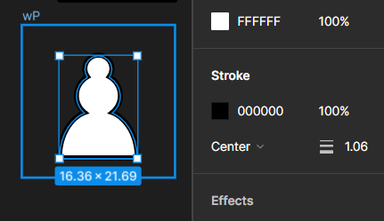
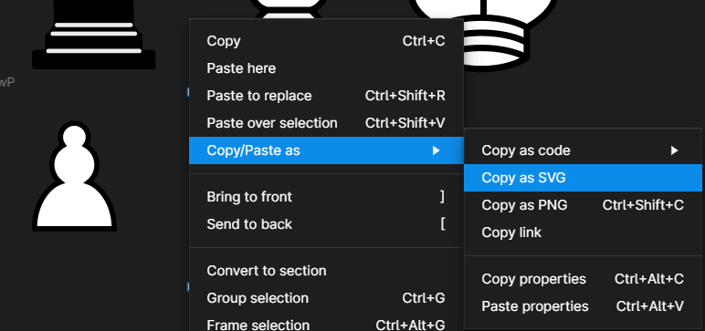
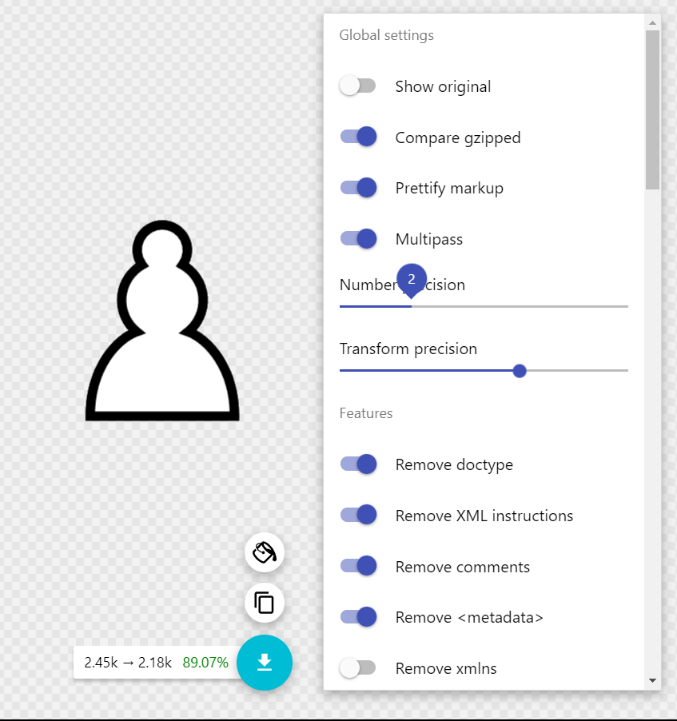

# Contributing Guide

## How to setup the project?
1. Fork the repo,
2. Open a terminal and clone the project with `git clone https://github.com/[your-github-username]/svelte-chess.git`,
3. Open the folder on your editor,
4. Install dependencies with `npm install`,
5. You're ready to start contributing 🎉

## Contributing new pieces sets

`svelte-chess` uses smaller and fewer optimized pieces assets.

- One `SVG` and `CSS` file for every set + one base `CSS` file.
- `CSS` for multiple pieces sets can be combined into one file if your app needs it.
- Every piece set is contained in a `32x32` viewport. Since we're using SVGs, there's no need to have a bigger viewport that would translate in a bigger file size because of the nature of SVGs.
- `SVG` for the all the pieces sets are optimized using [https://jakearchibald.github.io/svgomg/](https://jakearchibald.github.io/svgomg/) with the number precision set to `2`

### How to add new pieces?

1. Find a set of pieces that you would like to include. You can find more pieces on:
    - [Lichess repo](https://github.com/lichess-org/lila/tree/master/public/piece)
    - [Sharechess repo](https://github.com/sharechess/sharechess/tree/main/public/pieces)

2. Copy the set's SVGs to Figma. The frames will not be named with the pieces codes when you paste them on Figma like in the image bellow, it's up to you if you want to name them for organization purposes.

    

3. Make the calculation to scale every SVG's stroke-width down to the correct value for them to be `32×32` SVGs. *You are not going to resize the piece inside the frame, but the whole frame including the piece*. This is needed because if you resize the SVGs, the stroke will not be scaled up/down (it will stay the same). If the original size is `40×40` px and the stroke-width is `1.33`, we need to find the stroke-width for the `32×32` size. Formula: `(original_stroke_width * desired_size) / original_size = desired_stroke_width`.

     

    With the values from the image above, the formula will be: `(1.33 * 32) / 40 = 1.064`. Now we have the correct stroke-width for the `32×32` size:

     

4. Do the same for all pieces. Beware that some pieces may have different stroke-widths inside! You have to do the calculation for every different stroke-width.

5. Add a SVG file with the name of the set that you want to contribute and paste the following template inside:

    ```svg
    <svg xmlns="http://www.w3.org/2000/svg" fill="none" viewBox="0 0 32 32">
        <g id="bB" fill-rule="evenodd" clip-rule="evenodd">

        </g>
        <g id="bK" fill-rule="evenodd" clip-rule="evenodd">

        </g>
        <g id="bN" fill-rule="evenodd" clip-rule="evenodd">

        </g>
        <g id="bP" fill-rule="evenodd" clip-rule="evenodd">

        </g>
        <g id="bQ" fill-rule="evenodd" clip-rule="evenodd">

        </g>
        <g id="bR" fill-rule="evenodd" clip-rule="evenodd">

        </g>
        <g id="wB" fill-rule="evenodd" clip-rule="evenodd">

        </g>
        <g id="wK" fill-rule="evenodd" clip-rule="evenodd">

        </g>
        <g id="wN" fill-rule="evenodd" clip-rule="evenodd">

        </g>
        <g id="wP" fill-rule="evenodd" clip-rule="evenodd">

        </g>
        <g id="wQ" fill-rule="evenodd" clip-rule="evenodd">

        </g>
        <g id="wR" fill-rule="evenodd" clip-rule="evenodd">

        </g>
        <style>
            g {display: none;}
            g:target {display: inline;}
        </style>
    </svg>
    ```
    Note: The `style` tag is *very* important, do not remove it!

6. Go to Figma and select the frame of one of the pieces that you already resized (it's important that you select the whole frame and not just the piece inside), then right-click on the frame, click on `Copy/Paste as` and then on `Copy as SVG`.

    

    You will have something like this on your clipboard:
    ```svg
    <svg width="32" height="33" viewBox="0 0 32 33" fill="none" xmlns="http://www.w3.org/2000/svg">
        <path d="M16 6.8999C14.4285 6.8999 13.1556 8.17279 13.1556 9.74435C13.1556 10.3772 13.3618 10.9603 13.7103 11.4368C12.3236 12.2332 11.3778 13.7195 11.3778 15.4332C11.3778 16.8768 12.0463 18.1639 13.0916 19.0101C10.9583 19.7639 7.82227 22.9568 7.82227 28.5888H24.1778C24.1778 22.9568 21.0418 19.7639 18.9085 19.0101C19.9538 18.1639 20.6223 16.8768 20.6223 15.4332C20.6223 13.7195 19.6765 12.2332 18.2898 11.4368C18.6383 10.9603 18.8445 10.3772 18.8445 9.74435C18.8445 8.17279 17.5716 6.8999 16 6.8999Z" fill="white" stroke="black" stroke-width="1.06" stroke-linecap="round"/>
    </svg>
    ```

    It doesn't matter if it says `height="33"`, the only thing that we will need is the `path` tags. Copy all of them (in this case we only have one `path`)

    ```diff
    - <svg width="32" height="33" viewBox="0 0 32 33" fill="none" xmlns="http://www.w3.org/2000/svg">
        <path d="M16 6.8999C14.4285 6.8999 13.1556 8.17279 13.1556 9.74435C13.1556 10.3772 13.3618 10.9603 13.7103 11.4368C12.3236 12.2332 11.3778 13.7195 11.3778 15.4332C11.3778 16.8768 12.0463 18.1639 13.0916 19.0101C10.9583 19.7639 7.82227 22.9568 7.82227 28.5888H24.1778C24.1778 22.9568 21.0418 19.7639 18.9085 19.0101C19.9538 18.1639 20.6223 16.8768 20.6223 15.4332C20.6223 13.7195 19.6765 12.2332 18.2898 11.4368C18.6383 10.9603 18.8445 10.3772 18.8445 9.74435C18.8445 8.17279 17.5716 6.8999 16 6.8999Z" fill="white" stroke="black" stroke-width="1.06" stroke-linecap="round"/>
    - </svg>
    ```

    The piece that we copied is the white pawn (the code is `wP`). For a black pawn the code will be `bP`. Paste all the `path` tags inside the corresponding `g` tag (`<g id="wP" fill-rule="evenodd" clip-rule="evenodd">`):

     ```diff
    <svg xmlns="http://www.w3.org/2000/svg" fill="none" viewBox="0 0 32 32">
        ...
        <g id="wP" fill-rule="evenodd" clip-rule="evenodd">
    +        <path d="M16 6.8999C14.4285 6.8999 13.1556 8.17279 13.1556 9.74435C13.1556 10.3772 13.3618 10.9603 13.7103 11.4368C12.3236 12.2332 11.3778 13.7195 11.3778 15.4332C11.3778 16.8768 12.0463 18.1639 13.0916 19.0101C10.9583 19.7639 7.82227 22.9568 7.82227 28.5888H24.1778C24.1778 22.9568 21.0418 19.7639 18.9085 19.0101C19.9538 18.1639 20.6223 16.8768 20.6223 15.4332C20.6223 13.7195 19.6765 12.2332 18.2898 11.4368C18.6383 10.9603 18.8445 10.3772 18.8445 9.74435C18.8445 8.17279 17.5716 6.8999 16 6.8999Z" fill="white" stroke="black" stroke-width="1.06" stroke-linecap="round"/>
        </g>
        ...
        <style>
            g {display: none;}
            g:target {display: inline;}
        </style>
    </svg>
    ```

7. Repeat the previous step for all the other pieces.

8. When you finish, copy the whole SVG and paste it on [https://jakearchibald.github.io/svgomg/](https://jakearchibald.github.io/svgomg/). Set number precision to `2` and be sure to disable the `Collapse useless groups` option. Then, copy back the SVG to your editor (you should replace the old SVG with the new optimized version that you just copied). You might want to disable the `Prettify markup` option to get smaller sizes. Just beware that the `style` tag shouldn't be removed!

    

9. Remember to add attribution for the pieces sets.

10. Add a CSS file with the name of your pieces set with the following CSS rule inside: 
    ```css
    /* Replace `your-new-set-name` with the real name of the set */
    .your-new-set-name {
        --wP: url('your-new-set-name.svg#wP');
        --wB: url('your-new-set-name.svg#wB');
        --wN: url('your-new-set-name.svg#wN');
        --wR: url('your-new-set-name.svg#wR');
        --wQ: url('your-new-set-name.svg#wQ');
        --wK: url('your-new-set-name.svg#wK');
        --bP: url('your-new-set-name.svg#bP');
        --bB: url('your-new-set-name.svg#bB');
        --bN: url('your-new-set-name.svg#bN');
        --bR: url('your-new-set-name.svg#bR');
        --bQ: url('your-new-set-name.svg#bQ');
        --bK: url('your-new-set-name.svg#bK');
    }
    ```

11. Make the PR with your changes and you're ready to go 🎉

**Note:** If you need help with any of the steps or found a way to further optimize the process, don't hesitate on reaching out.